# From Strategy to Delivery

**Andrew Butenko**  
Enterprise Architecture • Solutions Architecture • Business Analysis • Digital Transformation • Platform Engineering • AI

_Another Practitioner Portfolio :). Prepared in support of my interview process._

---

## How to read this file

This portfolio is designed as a conversation guide rather than a formal presentation. It aligns with an [architecture-as-code](https://github.com/banban/architecture-as-code) style repository because it is text-based, evolutionary, versioned, readable, reusable, and extensible with Mermaid diagrams, images, and links.

> It shows how I approach architecture analysis, solution design, transformation, and delivery. I do not present it formally, but I am happy to refer to examples and best practices if useful. 

---

# 1. Executive Summary

## What value do I bring?

I help organisations translate business needs into practical architecture decisions, governed solution designs, and measurable business outcomes.

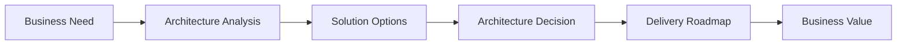

| Capability Area | Evidence |
|---|---|
| Architecture | Solutions Architecture, Enterprise Architecture practices, governance, capability alignment |
| Transformation Delivery | ERP transformation, cloud platforms, integrations, AI and knowledge management |
| Professional Practice | TOGAF Practitioner, Architecture-as-Code, technical author, continuous learning |

**Key message:** Architecture succeeds when business, people, and technology move in the same direction.

> My career has consistently focused on helping organisations make better technology decisions. While I have worked across software engineering, enterprise integration, cloud, analytics, and AI, the common theme has always been architecture.

---

# 2. Professional Journey

## How has my experience shaped my perspective?

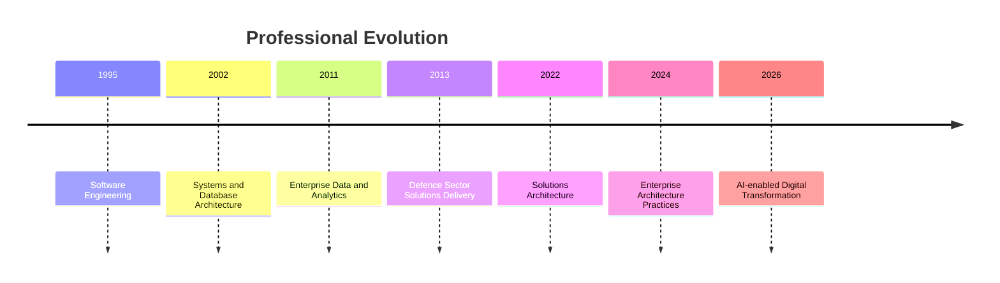

## Lessons learned

- Engineering builds credibility.
- Analysis creates understanding.
- Architecture provides direction.
- Governance enables sustainable change.
- AI amplifies business capability when applied responsibly.

> I started my career as a software engineer, learning how quality systems are designed, built, and supported. Over time, I moved into enterprise data, business intelligence, systems integration, and solutions architecture. More recently, my work expanded into enterprise architecture practices including governance, roadmaps, capability thinking, and AI-enabled transformation.

---

# 3. From Business Need to Architecture Decision

## How do I approach complex business problems?

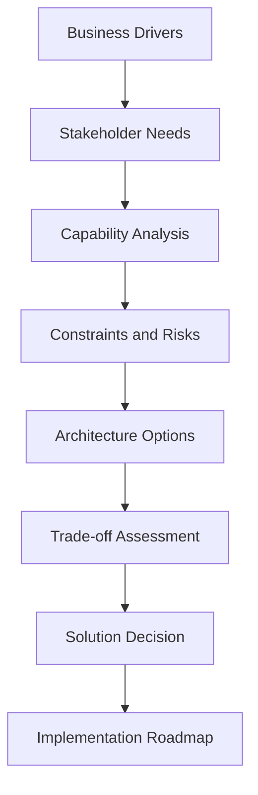

## My approach
Every architecture initiative starts with understanding the business problem rather than selecting a technology. My role is to analyse stakeholder needs, understand constraints, explore options, and recommend an architecture that balances business value, feasibility, cost, and risk.

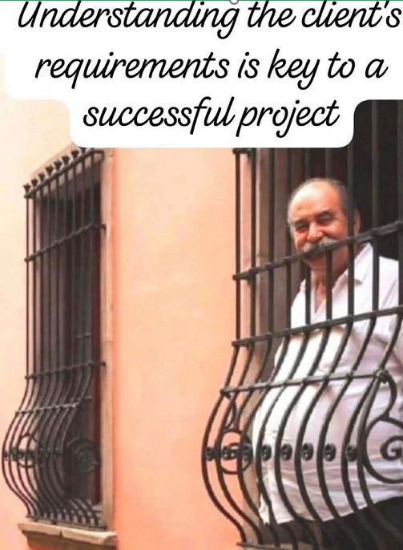

- Understand business objectives before proposing technology.
- Analyse stakeholder needs, constraints, and risks.
- Evaluate multiple options and trade-offs.
- Align architecture decisions with long-term capability.

---

# 4. Structured Transformation Approach

## How do I structure enterprise transformation?

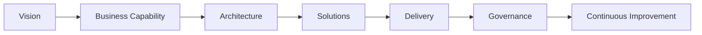

## Practical use of TOGAF

I use TOGAF as a practical thinking framework, not as a rigid checklist.

| TOGAF concept | Practical use |
|---|---|
| Architecture Vision | Create shared understanding |
| Business Architecture | Clarify capabilities and value streams |
| Application / Data / Technology Architecture | Structure solution options |
| Opportunities and Solutions | Prioritise delivery roadmap |
| Governance | Maintain alignment and control |

> TOGAF helps structure conversations and decisions. It provides a common language to connect business strategy, capabilities, architecture, delivery, and governance.

---

# 5. Turning Analysis into Architecture

## How do I connect strategy with engineering?

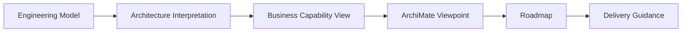

## Why this matters

- Engineering teams need technical precision.
- Business stakeholders need decision-oriented views.
- Delivery teams need clear direction and priorities.
- Architecture provides the translation layer.

> One of the most valuable parts of architecture work is translating detailed engineering or systems models into architecture views that different stakeholders can understand.

MBSE engineering vision ([source](https://linkedin.com/posts/memko_mbse-digitalengineering-systemsengineering-activity-7335173854996111361-Eb9C/?utm_source=share&utm_medium=member_desktop&rcm=ACoAAAY5S2gB8sDHYfQRv2xRKKC8Q9KRaEMW6IU)).
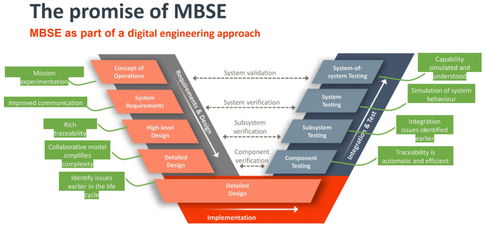

Translated architecture view ([ArchiMate](https://www.archimatetool.com/)) 
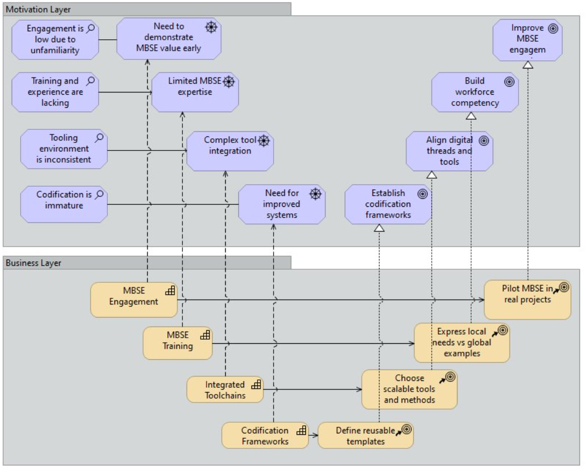

---

# 6. Enterprise Transformation in Practice

## How do I turn architecture into delivery?

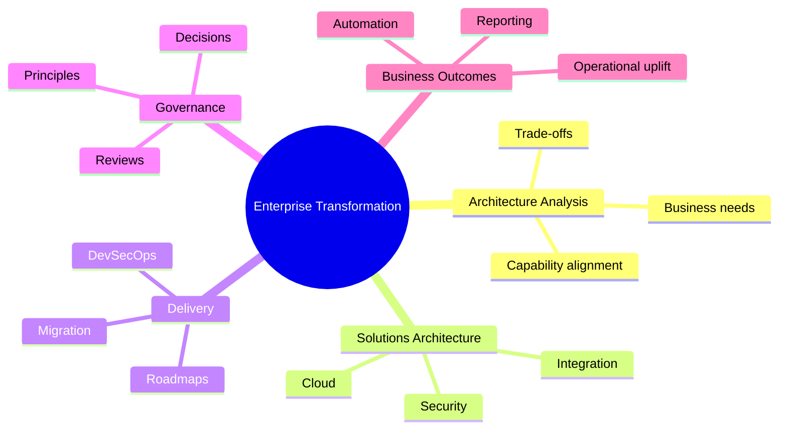

## My focus

- Translate priorities into executable architecture.
- Balance strategic direction with delivery constraints.
- Keep architecture practical and implementable.

> I enjoy taking strategic objectives and breaking them down into practical initiatives that delivery teams can execute. My focus is always on architecture that can be implemented, governed, and sustained.

---

# 7. Case Study: Enterprise Digital Transformation

## How can I contribute to large enterprise transformation?

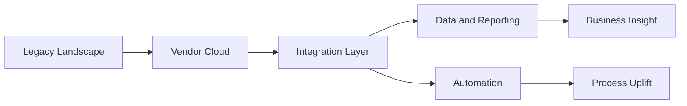

| Business challenge | Architecture response | Business outcome |
|---|---|---|
| Fragmented legacy systems | Integration architecture | Better operational continuity |
| Manual processes | Cloud automation | Reduced manual effort |
| Disconnected reporting | Semantic reporting models | Improved decision making |
| Complex stakeholder needs | Architecture governance | Controlled transformation |

> A representative example is enterprise transformation involving multi-cloud integrations, reporting, and automation. The architectural challenge was not just connecting systems, but maintaining business continuity and creating a platform for future change.

---

# 8. AI as an Architecture Capability

## How do I use AI responsibly?

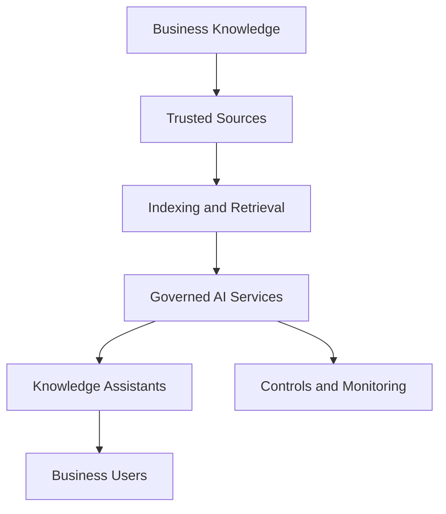

## Principles

- AI must support business capability, not just experimentation.
- Governance is essential for trust.
- Knowledge quality matters more than model size.
- AI should improve decisions, productivity, or consistency.

> I avoid AI hype. My approach is to treat AI as an architecture capability. The real questions are: what business problem does it solve, what knowledge sources are trusted, how is access governed, and how do we measure value?

---

# 9. Architecture as a Professional Practice

## How do I continue growing as an architect?

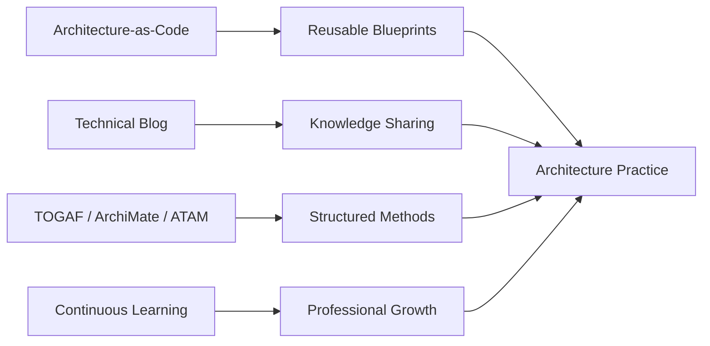

| Practice | Purpose |
|---|---|
| Architecture-as-Code repository | Capture reusable architecture patterns, blueprints, ADRs, and frameworks |
| Technical blog | Share lessons learned and document technical practice |
| TOGAF / ArchiMate / ATAM | Structure architecture thinking and communication |
| Continuous learning | Maintain relevance across cloud, AI, integration, and governance |

> Architecture is not just something I do at work. I treat it as a professional discipline. Framework is not a library - it is a way how people think.

---

# 10. Architecture Case Studies

## What business outcomes have I delivered?

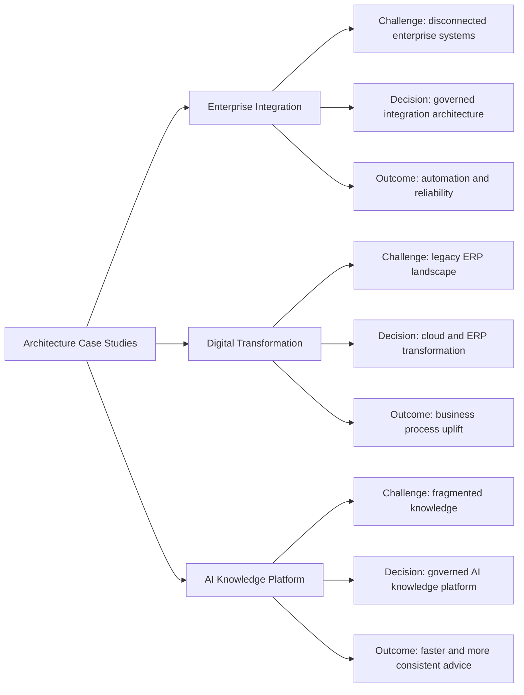

> These examples show a consistent approach across different technologies: understand the business problem, analyse constraints, design architecture options, and deliver practical outcomes.

---

# 11. Professional Thought Leadership

## How do I contribute beyond project delivery?

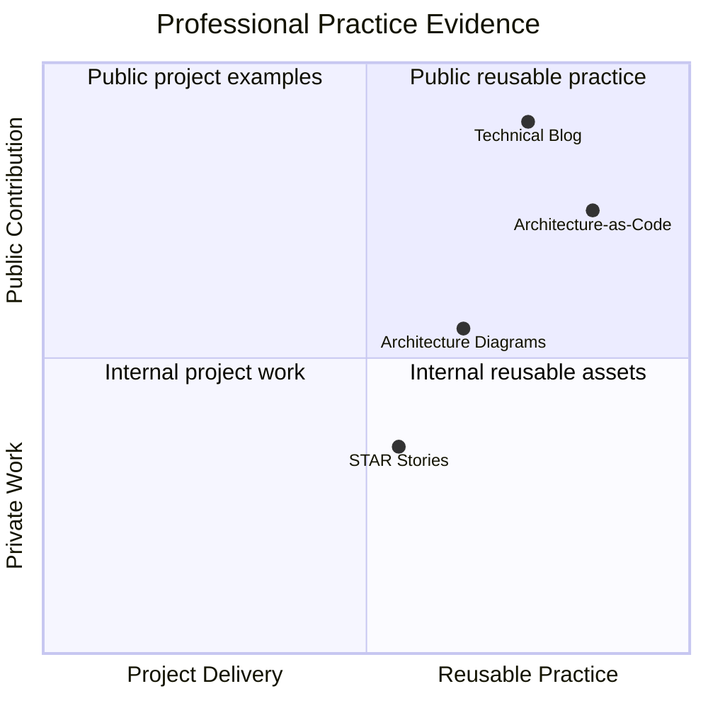

## Blog statistics
I have invested in documenting technical and architecture knowledge because reusable knowledge improves consistency, capability, and decision making.

[https://andrewbutenko.wordpress.com/](https://andrewbutenko.wordpress.com/)
- 16 years of technical writing
- ~170 countries
- 48,000+ views
- 29,000+ visitors
- Global readership

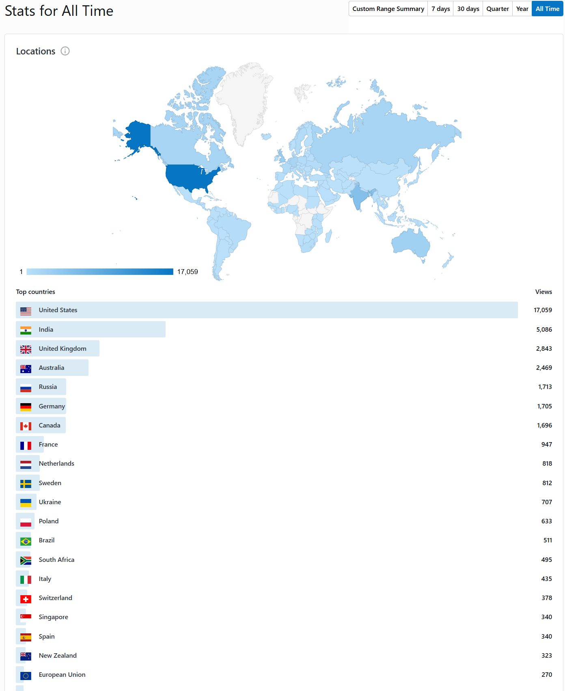
---

# 12. Behavioural Evidence

## How do I demonstrate behaviours expected in the role?

| Behaviour | Example to use in interview |
|---|---|
| Strategic Vision | Enterprise architecture and transformation roadmaps |
| Creativity | Middleware solution for Oracle invoice constraints |
| Adaptability | Cloud, AI, ERP and integration changes |
| Collaboration | Business stakeholders, developers, vendors, finance, payroll, ICT |
| Integrity | Challenging requested solutions when better options existed |
| Courage | Taking ownership of difficult integration and governance problems |
| Inspiration | Architecture-as-Code, blog, AI knowledge assistants |

It is not only about technical capability. It is also about how I work with people, communicate, adapt, and contribute to trust and collaboration.

---

# 13. How can I help organisations?
My work responsibilities align with analysing business needs, shaping architecture options, communicating with stakeholders, and supporting delivery.

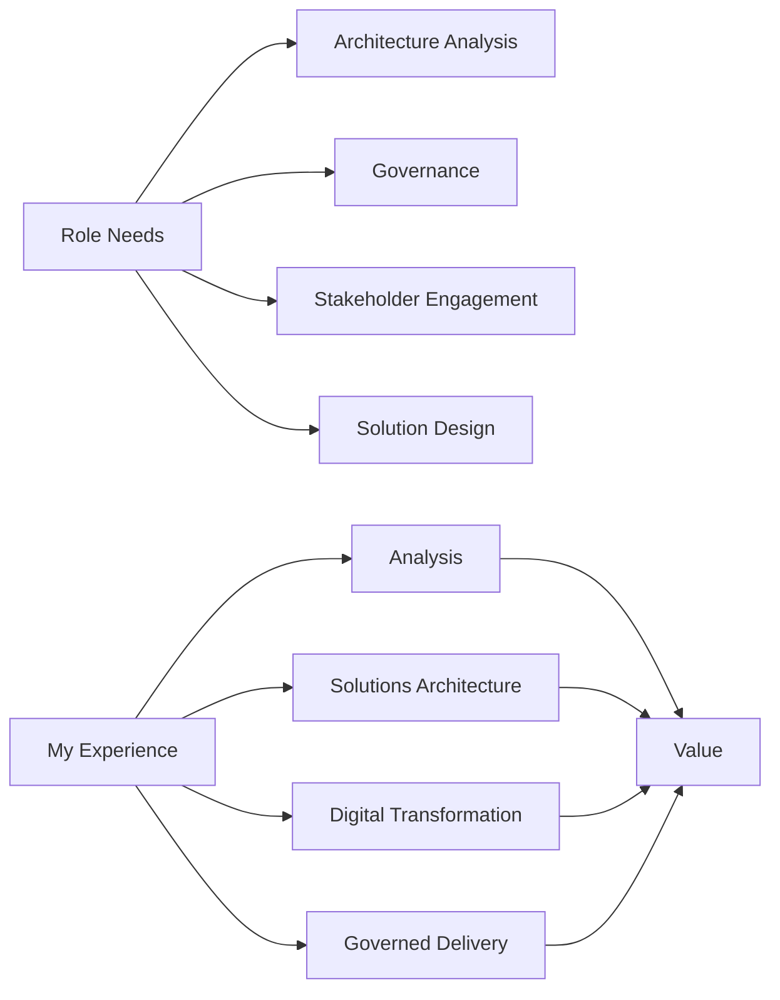

| Role expectation | My alignment |
|---|---|
| Architecture analysis | Strong system analysis and solutions architecture background |
| Solution design | Enterprise integration, cloud, ERP, AI and reporting |
| Governance | TOGAF, architecture artefacts, reviews, decision records |
| Stakeholder engagement | Business systems, finance, ICT, pre/post sales support, engineering, vendors |
| Technical breadth | C#, Python, SQL, Azure, Power BI, Oracle, integrations; exposure to data platforms (Databricks, Snowflake, etc.) and modern cloud-native services |

---

# 14. How Can I Contribute?

## What value will I bring to the team?

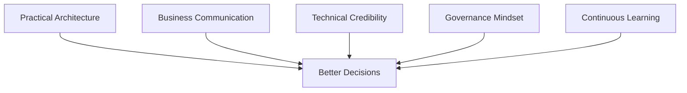

## Contribution areas

- Practical architecture analysis.
- Clear communication between business and technology.
- Strong integration and cloud delivery experience.
- Governed adoption of AI and emerging technologies.
- Reusable architecture practices and documentation.

> My goal is not simply to design solutions. My goal is to help people make better technology decisions, reduce ambiguity, and create architecture that delivery teams can actually use.

---

# 15. Questions I May Ask You

## What I would like to understand

- How does the architecture function interact with business systems teams?
- How are architecture decisions governed and recorded?
- What are the main challenges the Architecture role is expected to address in the first six months?
- How mature are the current architecture, models, and repositories?
- How does Solutions Architecture work together with other roles in practice?
- What would success look like after 6-12 months?

> I use these questions depending on how the conversation develops.

---

# 16. Closing

> Great architecture is not measured only by diagrams produced. It is measured by the decisions it enables and the outcomes it supports.

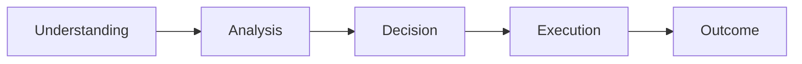

**Andrew Butenko**  
LinkedIn: www.linkedin.com/in/andrew-butenko-8098ab10  
GitHub: github.com/banban/architecture-as-code  
Blog: andrewbutenko.wordpress.com

---

# Appendix A - 90 Second Introduction

Thank you for reading my story. I appreciate the opportunity to discuss how my experience aligns with your expectations.

My background combines software engineering, system analysis, enterprise integration, solutions architecture, cloud, AI, and architecture governance. I spent many years working in different environments where technology decisions needed to balance business value, operational constraints, security, compliance, and delivery practicality.

My strongest areas are development, solutions architecture, and platform engineering. I also bring strong analytical capabilities: understanding business needs, analysing constraints, shaping architecture options, and translating complex technical topics into language that business and delivery stakeholders can work with.

---

# Appendix B - Architects vs Others

TOGAF defines a clear boundary between enterprise (system, solutions, enterprise) and domain (business architects, SME) specialists. I also see business analysis as an adaptation of the discipline that ensures solutions architecture is grounded in the right business problem.

A Solutions Architect focuses heavily on solution design and technology choices. An Architecture Analyst contributes by understanding business drivers, analysing capabilities and constraints, assessing options, supporting governance, and helping maintain traceability from business need to architecture decision.

In practice, I have worked across both areas. I analyse the business and system context, staying technically credible to shape solution design and support delivery.

---

# Appendix C - My Stack

My strongest production background is C#, SQL, Python, AI, data engineering, integration, and scripting. I also have educational experience with C++, Java, Go. I understand modern cloud-native services (Azure, AWS, GCP, Oracle), and microservice-style development (Docker, Kubernetes). More broadly, as an architect, I focus on understanding the structure of data, strengths of utilised platforms, trade-offs, runtime characteristics, and delivery implications of different technology stacks rather than promoting a single preferred language. I am also an experienced full-stack system engineer: backend, middleware, frontend.

---

# Appendix D - Six STAR Examples

| Question type | Best example |
|---|---|
| Strategic vision | Ask me to build a transformation roadmap |
| Creativity | Check my [Youtube portfolio playlist](https://www.youtube.com/watch?v=gKHDvFfozak&list=PL6tN65djuMbYepdOWK5Uj9EthS8xUUsMj)  |
| Adaptability | Bottlenecks are constantly migrating |
| Collaboration | Show me your frameworks and I will find how to improve them and connect with others |
| Integrity | Challenging stakeholder-requested solution when a better option existed |
| Inspiration | Architecture-as-Code, blogging, ML/AI exploration enthusiast |
